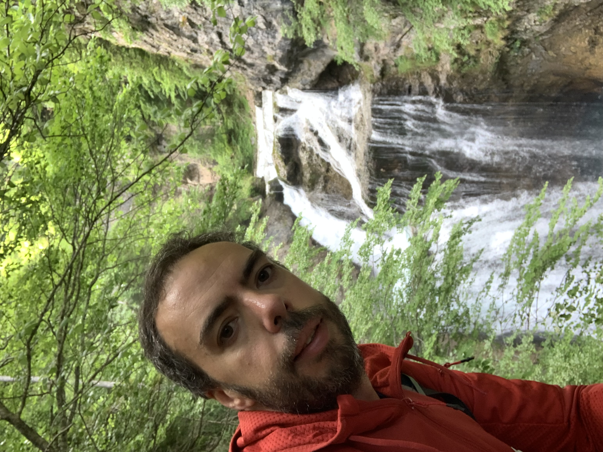
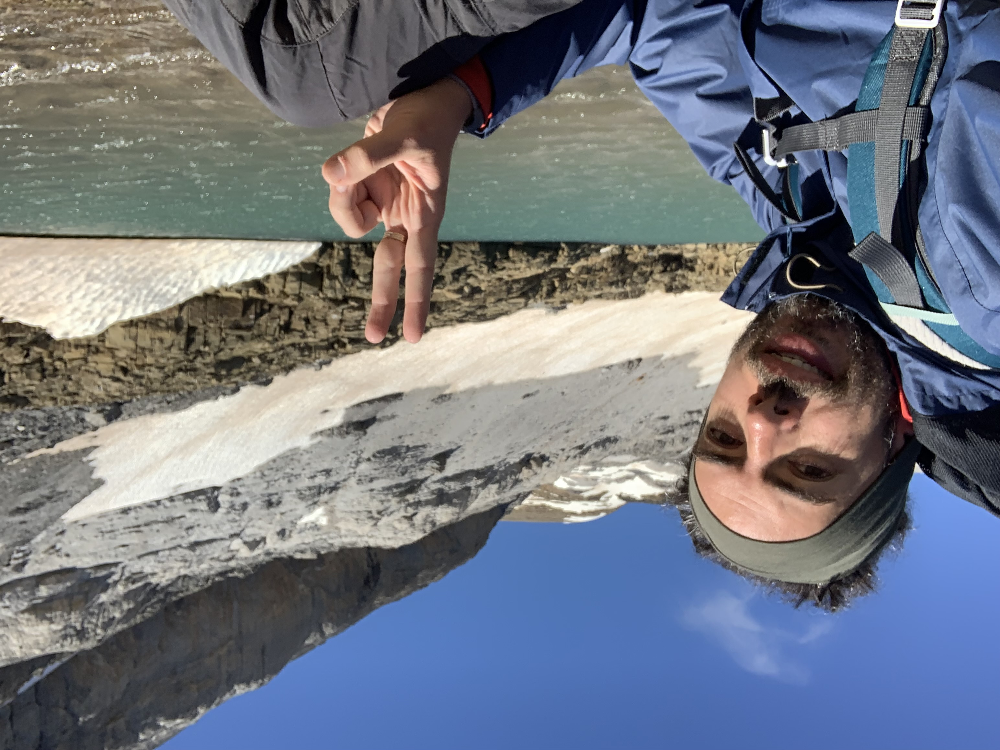

## Ruta por Ordesa y Monteperdido

# Origen

En verano de 2021 fuimos al valle de Pineta a la boda de mi primo. Carol ya había ido con los scouts de joven y ya me dijo que era muy bonito, así que aprovechamos a hacer una excursión a ver algunas cascadas y visitar algunos pueblos que ella conocía. Claro que era bonito, pero además impresionante ver esas montañas tan altas, y allí se me ocurrió que nunca había subido una montaña así... hacía poco que estaba saliendo a caminar más y comer mejor, y pensé en que entrenar para poder subir Monteperdido era la motivación para continuar haciéndolo regularmente, así que me puse de plazo el verano de 2022 para intentar la hazaña. Era importante para mí poder llegar en buena forma y me lo tomé en serio, pero esto daría para otro post, otro día quizás!

_Vistas desde el valle de Pineta_

# Planning

Al principio pensé en ir con 2/3 amigos que habían mostrado interés, pero por cambio de trabajo se precipitó la aventura a primeros de junio, y no me daba tiempo a organizarlo con gente - sobretodo porque el refugio de Góriz se llenó enseguida y corria el riesgo de quedarnos sin sitio, así que cambié los planes y reservé 5 días en solitario.

Debido a las fechas sabía que aún habría nieve en la escupidera, el tramo final y más complicado, con una gran inclinación y uno de los puntos donde más gente fallece en los pirineos. Así que ya me iba haciendo a la idea que no subiría arriba del todo, pero tenía más cosas previstas y no iba a correr riesgos innecesarios. La idea inicial era viajar a Torla el día 6, dormir en un hotel y descansar bien. El 7 subir a Góriz, el 8 ruta hasta la brecha de Rolando (o cerca), el 9 ruta hasta Monteperdido (al menos hasta el Ibon helado), y el 10 bajar otra vez a la pradera y de ahí ya conducir hasta casa (4 horas). La ventaja de ir solo es que pude improvisar un poco, pero tenía un buen plan.

El refugio de Góriz casi parece un hotel, hay desayuno, cena caliente, duchas, y personal muy amable que ayuda con las rutas y el tiempo, así que era un buen campamento base para mi pequeña aventura. Ya sólo faltaba preparar la mochila! Como quería estar seguro de no perderme, en la mochila incluí dos teléfonos móviles con las rutas en Wikiloc por duplicado, con los mapas descargados para consulta offline, una batería externa de 20000mAh (0.5Kg!), otra peque de unos 3000mAh, cables por duplicado, y lo indispensable para una travesía en solitario: ropa de abrigo, cortavientos, puffs, botiquín, comida, barritas, protección solar, gafas de sol, bolsas para la basura, frontal, saco, unas buenas botas de montaña, botella de agua, etc. En el refugio además ofrecen picnic para llevarte en tu travesía, así que si me quedaba sin comida podría sobrevivir bien.
Al final llevé una mochila de unos 8Kg, sólo un pelín más de lo que había estado entrenando, bien! \o/

# Día 1

Llegué en coche a Torla sobre las 8 del día 6, hora prevista. Pueblo muy cuidado y con mucha vida, gracias al turismo montañero. Me costó dormirme, un poco por el calor, otro poco por los nervios, pero al final descansé bastante bien y trás un desayuno bien completo, camino a la pradera. Al ser temporada baja no me hizo falta ir en autobús, así que pude aparcar el coche en la pradera y de ahí iniciar la marcha sobre las 8h30 de la mañana, pero hay que contar que si se va en temporada alta hay que dejar el coche en Torla e ir en autobús.

_Vistas a Ordesa desde Torla_

La ruta desde la pradera hasta Cola de caballo son unas 2h30. Es una ruta variada y muy chula, primero por un camino muy bien señalizado, luego por un hayedo con un poco de cuesta, luego viendo cascadas junto al río, y luego un tramo más llano hasta la gran cascada. Fuí haciendo paradas cortas, fotos, bebiendo bastante y poniéndome mucha crema, pese a ser junio ya hacía mucho calor.

Trás reponer un poco de fuerzas reanudé la marcha y conocí un muchacho de Colombia (Mauricio) que estaba siguiendo la GR11, que pasa por Góriz también - él iba a subir por las clavijas de Soaso, una pared que hay que trepar pero que hay cadenas para ayudar, y que ahorra una media hora de trayecto, así que me animé a ir con él. No es un tramo difícil, pero lo hice con mucho cuidado porqué con la mochila me podría ir para atrás, y salvo un par de zancadas altas es bastante seguro.

_Vistas tras subir por las clavijas de Soaso_

A partir de ahí las vistas mejoraban por momentos, por delante el gran Monteperdido, por detrás el valle entero. El tramo final costó 1h30 aproximadamente, enseguida se suben metros y entre el calor y la mochila tuve que hacer un par de paradas más, pero aprendí de Mauricio a caminar un poco más lento y parar 2-3 minutos para recuperar aliento cuando me hiciera falta. Fruta y una barrita ayudaron también! Al final llegamos al refugio sobre las 12h30, 4h de trayecto. Llegué un poco cansado pero mucho mejor de lo que esperaba. Sabiéndolo seguramente me habría desviado en la pradera para ver las cascadas de Cotatuero, calculo que habría sido 1h30 de desvío, pero no quería arriesgar a llegar demasiado cansado arriba el primer día.

_Al fin el refugio!_

Como llegué muy bien fisicamente, después de comer y descansar un poco me hice una ruta hasta pasado el Collado de Arrablo (la ruta que va a Pineta creo), unas 2h ida y vuelta muy tranquilamente. En total fueron unos 18km de travesía, y unos 1100 de desnivel positivo: unos 12km hasta Góriz y 6km de ir y volver al Collado, dando algún rodeo adicional. Caí redondo en la cama antes de las 10h de la noche, pensando en la ruta del día siguiente.

# Día 2

Sobre las 7 estaba ya desayunando y revisando la ruta del día. El plan era llegar hasta la base de la brecha de Rolando, aunque en el refugio ya me comentaron que había mucha nieve aún, y que bajara hasta abajo despues del segundo collado para poder subir bien, por la ruta corta era más peligroso. Además el día iba a estar nublado, y aunque no había previsión de lluvia podía haber más riesgo, así que a las 7h30 arranqué dirección la brecha.

_No lo veo claro eh_

El camino no es muy complicado, hay algunas trepadas al principio y algunos hitos que ayudan a seguir la ruta fácilmente, pero es un camino muy solitario así que vigilo mucho por donde voy para no desviarme de la ruta. A medio camino me encuentro solo a 3 personas haciendo la travesía inversa, seguramente desde Bujaruelo.
La primera llanura es muy verde y fácil de seguir, y aprovecho a disfrutar las vistas bien mientras avanzo.

_Después de la subida inicial el camino transcurre por una larga llanura_

Para el siguiente collado ya hay nieve y tengo que revisar bien la ruta para subir, no tiene mucha pérdida y como es un collado amplio puedo elegir bien el camino menos arriesgado, aunque hay poca inclinación e incluso subiendo por la nieve es muy seguro.

_Vista del collado, aun hay nieve pero la ruta es muy asequible_

_Detrás mío vienen 2 grupos, pero se desviarían a partir del collado y no llego a coincidir con ellos, en la foto se pueden ver!_

Una vez pasado el collado, sigo el camino marcado que transcurre por la derecha y así no tengo que bajar a la llanura, que además esta llena de nieve aún. Solo hay un par de tramos con un poco de nieve, que son fáciles de cruzar o sortear, y llego al siguiente collado fácilmente.

_En fotos no se pueden apreciar las distancias, lamentablemente!_

_Bajando el siguiente collado, tal como me recomendaron en el refugio - si frunces el ceño se pueden ver dos personas a lo lejos!_

Aquí empiezo a vigilar más el reloj, la hora y las nubes, pueso llevo unas 2h30 de travesía y tengo que calcular que la vuelta tardaré casi lo mismo. Si el día anterior hice 30000 pasos, 18km, quería calcular una ruta solo ligeramente mayor, para no agotarme demasiado y poder volver bien, contando que podría ponerse a llover y se complicaria. A la derecha ya tendría la brecha, pero al ir pegado no la pude ver bien, así que seguí por la llanura y decidí subir el pequeño pico en el siguiente collado, seguro que habría buenas vistas. Desde allí además podria ver el Taillón de cerca, y aunque estaba muy bien fisicamente, me pareció arriesgado subir más, estaba en medio de la nada y a unos 2500m.

_Vista del Taillón parcialmente cubierto desde el último collado que subí_

_Vista de la ruta que he estado haciendo, desde arriba del collado_

Subir al collado es relativamente fácil, aunque hay un poco de inclinación y mucha piedra suelta. Aprovecho a descansar arriba un buen rato disfrutando las vistas, comer un poco y revisar el camino y tiempos que he hecho hasta aquí. Calculo que si salgo ahora llegaré al refugio sobre las 14h30, en total unas 7h de travesía, así que estoy bastante tranquilo, y el tiempo se mantiene bastante estable.
Al bajar del collado cruzo la llanura por el otro lado, para poder ver bien la brecha, y se ve espectacular. Ahí me entra la duda de si intentar subir un poco más por el camino que se ve en medio, que hay nieve pero es bastante seguro, y físicamente voy muy bien, pero mirando el reloj veo un poco arriesgado intentarlo. En frío yo creo que hubiera ido sin dudarlo, pero allí se veía todo más grande y lejos.

_La brecha al fondo, y el camino parcialmente nevado que me habría podido acercar hasta la base. Hasta arriba hubiera necesitado crampones porque era todo nieve y había más inclinación_

El trayecto de vuelta fué muy tranquilo, aproveché a hacer pequeños desvíos y buscar más vistas, y paré a comer tranquilamente en una faja con vistas al valle, y llegué sobre las 14h30 al refugio.

_Vistas durante la comida, ahí en el rincón se puede ver el refugio a la distancia_

Por la tarde estuvo chispeando un poco, así que aproveché a descansar un poco, leer, e investigar el camino para subir a Monteperdido el día siguiente, con varias rutas cortas. En total caminé unos 23km, 32000 pasos, menos desnivel que el día anterior y sin mochila, así que seguía muy fresco para el día fuerte. Durante la cena estuve hablando con una pareja con la que había coincidido en el hotel de Torla, y me contaron que también estaban haciendo rutas por Ordesa. Una de ellas fué una travesía desde Bujaruelo al Pic de la Pahule, desde donde hay unas vistas increíbles al circo (y la cascada) de Gavarnier, ruta de unas 6h en total. Por lo que ví allí los dos dias que estuve, el plan suele ser subir a Góriz, dormir, subir a Monteperdido y bajar a la pradera el mismo día, y empecé a darle vueltas a ver si podía encajar esa ruta el viernes...

# Día 3

Otro día de madrugar con muchas ganas de subir, y no se veía ninguna nube, así que me levanté a desayunar bien y preparar el día. Luego entendí que no se veía ninguna nube porque hacía muchísimo viento, lo que seguramente complicaría la subida un pelín.

_Si no había nubes es porque se las estaba llevando el fuerte viento_

La subida a Monteperdido es de alta montaña, mucha parte de usar las manos, trepadas, caminos de piedra, y caminos sin marcar, aunque de fácil seguimiento con los hitos. Había varios grupos subiendo, lo que también ayuda a tomar según que decisiones. El trayecto es de subida constante, y bastante seguro, aunque hubo momentos en los que el viento apretaba fuerte y había que ir con más cuidado.

_Las vistas al valle, pero desde más arriba aún_

A los casi 3000 metros llegué justo abajo del Ibon helado, pero había un trozo de nieve final que era bastante delicado y casi todo el mundo que llegó allí se uso los crampones. Anque hubo algunos montañeros experimentados que lo hicieron sin crampones, gracias a que las pisadas estaban muy marcadas, yo no me atreví, y me conformé con haber llegado hasta allí, realmente un logro para mí y mi sedentarismo.

_Justo debajo del Ibon helado, a casi 3000 metros, a la derecha la escupidera y la cima a tiro de piedra_

Durante el trayecto de bajada aún seguía muy bien físicamente, así que me desvié por la faja lateral, yendo hasta el Fraile, un camino muy suave y fácil y en el que acabé en un lago pequeño y vistas desde arriba del camino que hice el día anterior, y ahí acabé de fraguar mi improvisación. Bajaría hasta el refugio, cogería los bártulos y bajaría hasta la pradera, para ir a un hotel en Torla otra vez, y al día siguiente intentar la ruta al mirador de Gavarnier. Planazo!

_Improvisando ruta por El Fraile, salió muy bien!_

_Por ahí abajo estuve el día anterior_

La bajada hasta el refugio fué bastante ligera, ya no hacía tanto viento y el cielo dejaba unas vistas clarísimas, y desde el Fraile improvisé un poco la bajada hasta volver al camino oficial. Una vez allí cancele la reserva, pagué todo (se puede pagar hasta con tarjeta, por cierto), y tras comer un poco empecé la bajada, sobre las 14h30. Además a medio camino es el único momento que hubo cobertura, no la había echado de menos pero aproveché a mandar un mensaje y una foto a la família, ya que no sabían nada de mí desde que dejé la pradera!

La bajada hasta la pradera decidí hacerla por el camino alternativo para ver como era (el que me salté a la subida, que llaman las Zetas), y me alegró de haber subido por las clavijas porque realmente es un camino bastante más largo y serpenteante. Las vistas seguían siendo buenas para ver el valle, eso sí!

_Vistas desde el camino de las zetas_

Una vez abajo empecé a notar bastante el cansancio, ya llevaba unos 23km de travesía, más de 30000 pasos, y aún me quedaban unos 9km hasta llegar a la pradera... el problema fué que además al bajar por las zetas me fuí por el lado del río equivocado, fuí bajando pensando que podría cruzar, pero llegó un momento que reconocí el error y tuve que subir hasta Cola de Caballo otra vez. Ese error me costó fácilmente unos 45min de caminata extra, y ahora sí el cansacio se notaba más.
Paré a comer un poco más, hidratarme bien, hacía muchísimo calor, y fuí siguiendo el camino poco a poco, aunque los pies y rodillas empezaban a resentirse un poco, sobretodo tras haber bajado casi 2000 metros.

_Cola de Caballo desde las zetas, esos puntitos son gente!_

_La ruta hasta la pradera tiene 2 camino, estas son las vistas del camino que va más pegado a la montaña, pero me gusta mucho más el principal_

En este punto estaba realmente agotado, llevaba ya más de 33km acumulados, con unos 1200m de desnivel positivo (Monteperdido + El Fraile) y unos 2000m de negativo, iba parando cada media hora aproximadamente, el calor no ayudaba, aunque era más cansancio que dolor por lo que pude seguir, aunque fuera poco a poco. Íba muy bien de hora, pero aún así no quería tardar demasiado, ya que tenia que buscar donde dormir. En uno de los carteles ponía que eran unas 2h de trayecto hasta la pradera, y yo creo que tardé casi 3h... pero llegué!
Una vez en el coche reservé un hotel rápidamente, en Torla, justo al lado del que había tenido el primer día, y ya más relajado me cambié, descansé y me fui allí a darme una buena ducha y tumbarme en la cama.
La cosa es que llegué tan cansado que descarté la ruta a Gavarnier el día siguiente, pero buscando alternativas encontré una ruta más dominguera para el últim día, no sabía como me levantaría pero si me encontraba con ganas podía ser una buena despedida, unas 3~4h de excursión.
Eso sí, primero una buena cena y luego a caer rendido.
