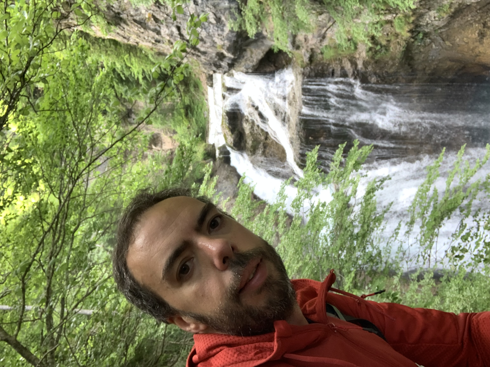

## Ruta por Ordesa y Monteperdido

# Origen

En verano de 2021 fuimos al valle de Pineta a la boda de mi primo. Carol ya había ido con los scouts de joven y ya me dijo que era muy bonito, así que aprovechamos a hacer una excursión a ver algunas cascadas y visitar algunos pueblos que ella conocía. Claro que era bonito, pero además impresionante ver esas montañas tan altas, y allí se me ocurrió que nunca había subido una montaña así... hacía poco que estaba saliendo a caminar más y comer mejor, y pensé en que entrenar para poder subir Monteperdido era la motivación para continuar haciéndolo regularmente, así que me puse de plazo el verano de 2022 para intentar la hazaña. Era importante para mí poder llegar en buena forma y me lo tomé en serio, pero esto daría para otro post, otro día quizás!

_Vistas desde el valle de Pineta_

# Planning

Al principio pensé en ir con 2/3 amigos que habían mostrado interés, pero por cambio de trabajo se precipitó la aventura a primeros de junio, y no me daba tiempo a organizarlo con gente - sobretodo porque el refugio de Góriz se llenó enseguida y corria el riesgo de quedarnos sin sitio, así que cambié los planes y reservé 5 días en solitario.

Debido a las fechas sabía que aún habría nieve en la escupidera, el tramo final y más complicado, con una gran inclinación y uno de los puntos donde más gente fallece en los pirineos. Así que ya me iba haciendo a la idea que no subiría arriba del todo, pero tenía más cosas previstas y no iba a correr riesgos innecesarios. La idea inicial era viajar a Torla el día 6, dormir en un hotel y descansar bien. El 7 subir a Góriz, el 8 ruta hasta la brecha de Rolando (o cerca), el 9 ruta hasta Monteperdido (al menos hasta el Ibon helado), y el 10 bajar otra vez a la pradera y de ahí ya conducir hasta casa (4 horas). La ventaja de ir solo es que pude improvisar un poco, pero tenía un buen plan.

El refugio de Góriz casi parece un hotel, hay desayuno, cena caliente, duchas, y personal muy amable que ayuda con las rutas y el tiempo, así que era un buen campamento base para mi pequeña aventura. Ya sólo faltaba preparar la mochila! Como quería estar seguro de no perderme, en la mochila incluí dos teléfonos móviles con las rutas en Wikiloc por duplicado, con los mapas descargados para consulta offline, una batería externa de 20000mAh (0.5Kg!), otra peque de unos 3000mAh, cables por duplicado, y lo indispensable para una travesía en solitario: ropa de abrigo, cortavientos, puffs, botiquín, comida, barritas, protección solar, gafas de sol, bolsas para la basura, frontal, saco, unas buenas botas de montaña, botella de agua, etc. En el refugio además ofrecen picnic para llevarte en tu travesía, así que si me quedaba sin comida podría sobrevivir bien.
Al final llevé una mochila de unos 8Kg, sólo un pelín más de lo que había estado entrenando, bien! \o/

# Día 1

Llegué en coche a Torla sobre las 8 del día 6, hora prevista. Pueblo muy cuidado y con mucha vida, gracias al turismo montañero. Me costó dormirme, un poco por el calor, otro poco por los nervios, pero al final descansé bastante bien y trás un desayuno bien completo, camino a la pradera. Al ser temporada baja no me hizo falta ir en autobús, así que pude aparcar el coche en la pradera y de ahí iniciar la marcha sobre las 8h30 de la mañana, pero hay que contar que si se va en temporada alta hay que dejar el coche en Torla e ir en autobús.

_Vistas a Ordesa desde Torla_

La ruta desde la pradera hasta Cola de caballo son unas 2h30. Es una ruta variada y muy chula, primero por un camino muy bien señalizado, luego por un hayedo con un poco de cuesta, luego viendo cascadas junto al río, y luego un tramo más llano hasta la gran cascada. Fuí haciendo paradas cortas, fotos, bebiendo bastante y poniéndome mucha crema, pese a ser junio ya hacía mucho calor.

Trás reponer un poco de fuerzas reanudé la marcha y conocí un muchacho de Colombia (Mauricio) que estaba siguiendo la GR11, que pasa por Góriz también - él iba a subir por las clavijas, una pared que hay que trepar pero que hay cadenas para ayudar, y que ahorra una media hora de trayecto, así que me animé a ir con él. No es un tramo difícil, pero lo hice con mucho cuidado porqué con la mochila me podría ir para atrás, y salvo un par de zancadas altas es bastante seguro.

_Vistas tras subir las clavijas de Soaso_

A partir de ahí las vistas mejoraban por momentos, por delante el gran Monteperdido, por detrás el valle entero. El tramo final costó 1h30 aproximadamente, enseguida se suben metros y entre el calor y la mochila tuve que hacer un par de paradas más, pero aprendí de Mauricio a caminar un poco más lento y parar 2-3 minutos para recuperar aliento cuando me hiciera falta. Fruta y una barrita ayudaron también! Al final llegamos al refugio sobre las 12h30, 4h de trayecto. Llegué un poco cansado pero mucho mejor de lo que esperaba. Sabiéndolo seguramente me habría desviado en la pradera para ver las cascadas de Cotatuero, calculo que habría sido 1h30 de desvío, pero no quería arriesgar a llegar demasiado cansado arriba el primer día.

_Al fin el refugio!_

Como llegué muy bien fisicamente, después de comer y descansar un poco me hice una ruta hasta pasado el Collado de Arrablo (la ruta que va a Pineta creo), unas 2h ida y vuelta muy tranquilamente. En total fueron unos 18km de travesía, y unos 1100 de desnivel positivo: unos 12km hasta Góriz y 6km de ir y volver al Collado, dando algún rodeo adicional. Caí redondo en la cama antes de las 10h de la noche, pensando en la ruta del día siguiente.

# Día 2

Sobre las 7 estaba ya desayunando, y pensando ya en la ruta del día. El plan era llegar hasta la base de la brecha de Rolando, aunque en el refugio ya me comentaron que había mucha nieve aún, y que bajara en el
